# uroschess

[](https://github.com/urosdrnovsek/uroschess/actions/workflows/ci.yml)
[](LICENSE)

A chess game and small teaching app with a pygame front-end and a from-scratch
search engine. Complete a guided tournament-game lesson, replay annotated
games, play White or Black against the AI, watch it play itself, or pass-and-play
with a friend. The UI adopts your desktop theme (Omarchy) and the board is
textured and lit. No dependencies beyond `pygame`.

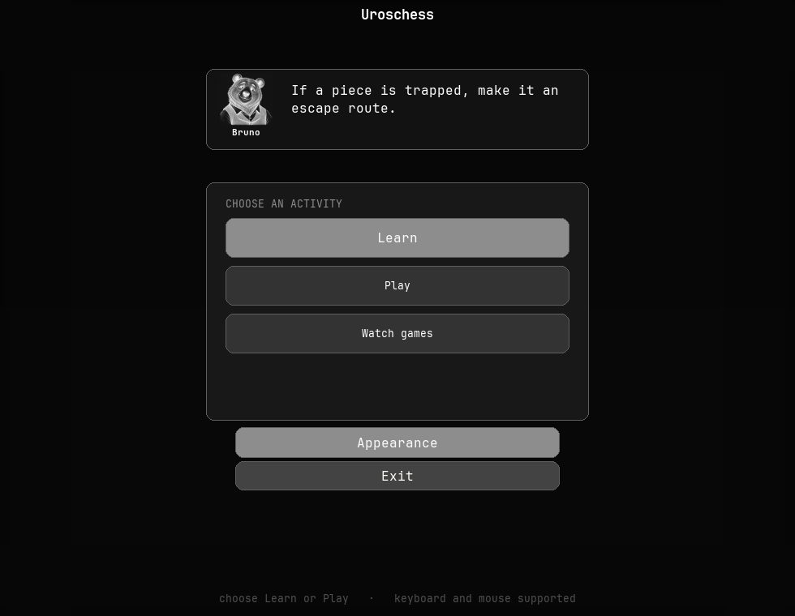

| Learn | Appearance |
| --- | --- |
| 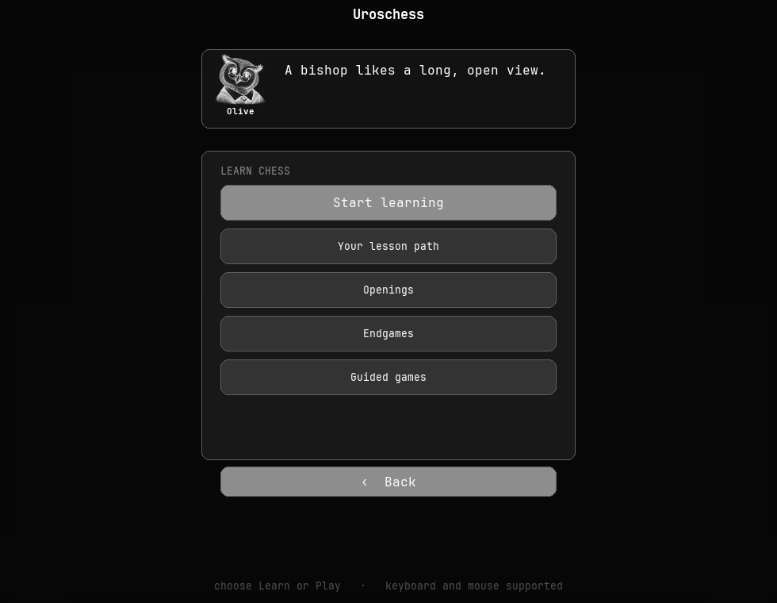 | 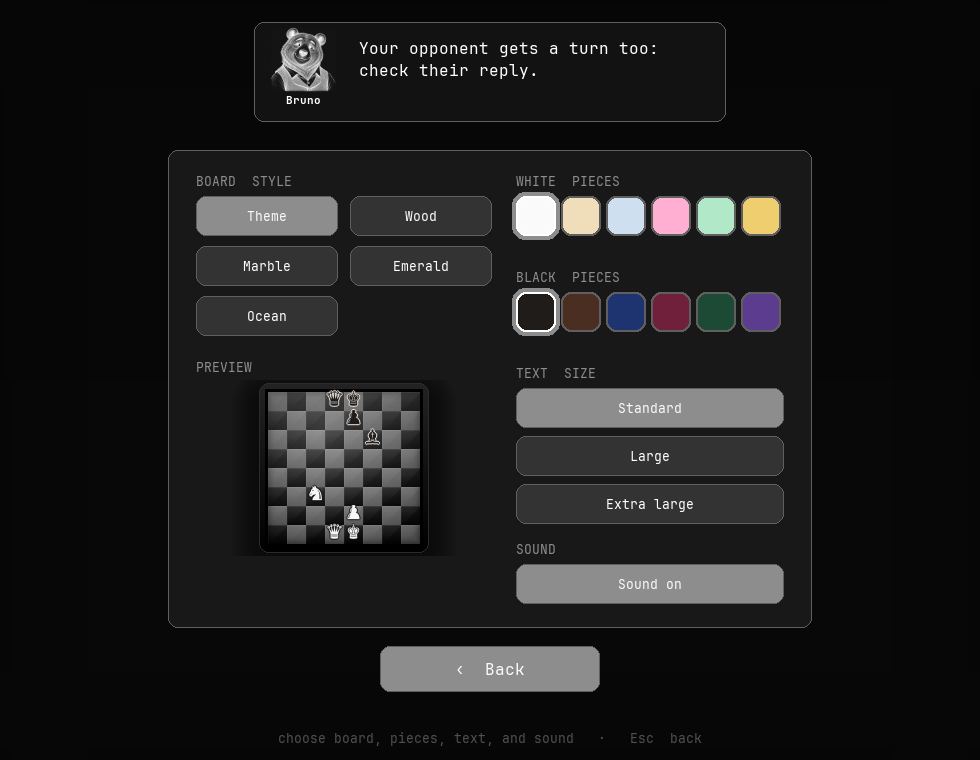 |

| Play | Lesson in a narrow window | Replay in a narrow window |
| --- | --- | --- |
| 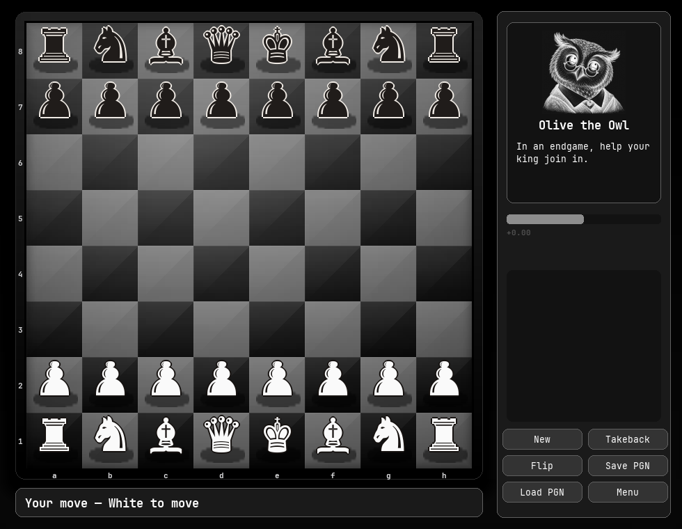 | 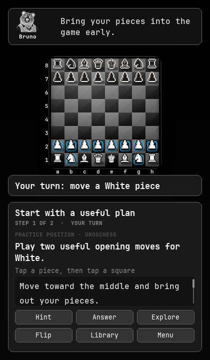 | 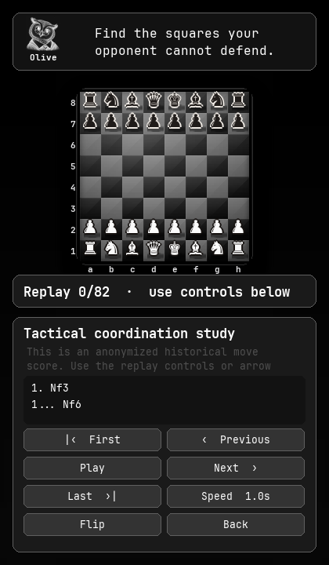 |

| Opening courses | Bruno course | Olive course |
| --- | --- | --- |
| 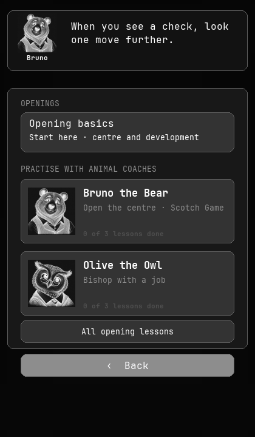 |  | 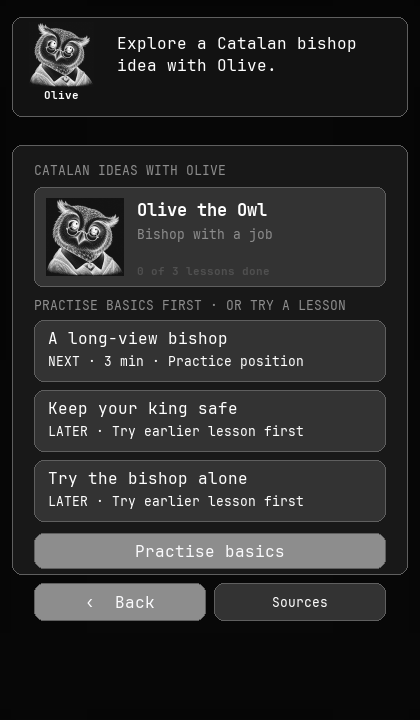 |

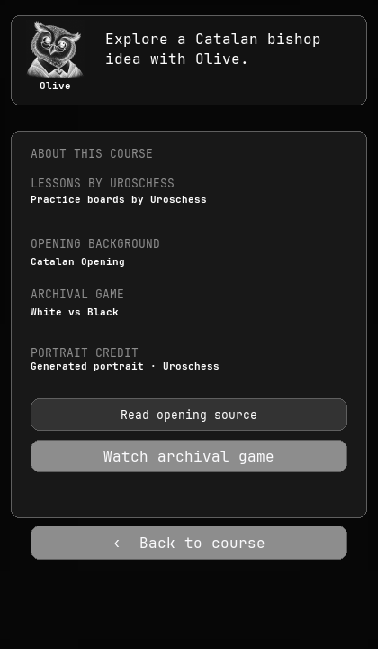

| Bruno lesson | Olive lesson |
| --- | --- |
| 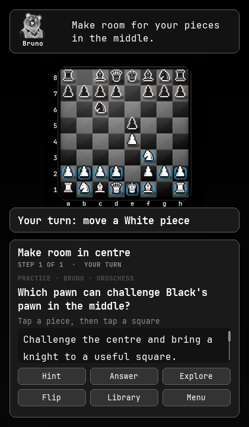 | 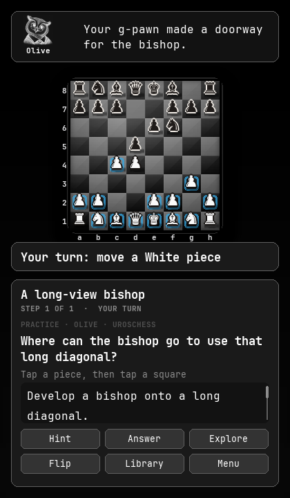 |

## Run

```bash
./run.sh
```

`run.sh` creates a virtualenv, installs any missing requirement, and launches
the game. If setup is interrupted, run it again to resume. Or do it by hand /
install it:

```bash
python3 -m venv .venv && .venv/bin/pip install -r requirements.txt
.venv/bin/python -m chess_game

# or install the `uroschess` command:
pipx install git+https://github.com/urosdrnovsek/uroschess
uroschess
```

The project declares **Python 3.8+** and CI currently tests Python 3.9, 3.12,
and 3.13. `pygame` is the only runtime dependency. Pip usually installs a
prebuilt wheel, but on a newer or less common Python/system combination it may
compile pygame locally, making the first launch take several minutes. The
Omarchy theme file is parsed without `tomllib`, so older supported Pythons work.

### Desktop launcher

```bash
./install.sh          # writes ~/.local/share/applications/uroschess.desktop
```

Works on any freedesktop.org Linux (GNOME, KDE, XFCE, Hyprland, …). Re-run if you
move the repo.

## Menu

The home menu offers **Learn**, **Play**, and **Watch games**. In **Learn**,
**Start learning** begins with opening basics; once a lesson is underway,
**Continue lesson** returns to the most recent unfinished one. **Your lesson
path** shows progress as done, next, or revisit. **Openings**, **Endgames**,
and **Guided games** open focused libraries. **Watch games** opens recorded
games with move-by-move notes and navigation.

In **Openings**, choose Bruno the Bear for three Scotch Game ideas or Olive
the Owl for three Catalan ideas. Each course ends with a related position to
try alone. These are original practice lines, with position-aware advice from
the fictional coaches. The chosen portrait stays with the lesson, and advice
changes with the position and your answer. Each course shows saved progress as
next, done, or revisit. When opening basics is unfinished, a **Practise basics**
button offers a route back. **Sources** gives background on the opening and
lets you replay an anonymized archival score. Completed lessons can also watch
the archival game and return to the same lesson. **Return to last course or
list** in Learn restores the course or list page you were browsing.

In **Play**, choose **Play against AI** or **Two players**. The AI screen lets
you play White or Black, watch AI vs AI, and set **Easy / Normal / Hard / Max**
difficulty (0.25 s to 6 s of thinking time per move). **Exit** quits.

**Appearance** opens a panel to pick a **board style** — **Theme** (derived
from your palette) or the material looks **Wood / Marble / Emerald / Ocean** — and
the **piece colours** (a swatch each for White and Black), with a live preview.
It also provides three text sizes and an on/off sound setting.
Boards are textured and lit: a soft spotlight, piece contact shadows, a sculpted
frame.

Most screens show an original animal coach portrait and a short chess tip.
Outside a selected course, the coach changes when you open another screen;
you can also click the portrait or press **N** to change it. The card and sketch
colours follow the active theme. Bruno and Olive share 24 original tips.

## Learn from games

The starter library includes an anonymized historical tactical score with a
three-question guided lesson **Make your pieces work together**. It has a
complete replay and concise notes at key moments. **Watch games** also includes
two anonymized archival opening scores associated with the Scotch and Catalan
courses. The course exercises themselves use original practice positions.

The teaching collection contains eleven original opening lessons and six
beginner endgames alongside the guided tactical lesson. The opening sequence
covers essentials, the Italian Game, the Queen's Gambit, and sound Black
replies to 1.e4 and 1.d4. Bruno and Olive add six short opening exercises. The
endgames cover mate versus stalemate, promotion, queen mate, rook mate, the
square rule, and king activity/opposition. Original practice lines and
historical scores are labelled separately.

Guided lessons open ready for a move: read the question, then move a piece on
the board. The first beginner exercises gently highlight movable pieces and
show a one-time “Tap a piece, then tap a square” tip. Reviewed answers can
be preferred, acceptable, or wrong; other legal moves open a temporary
exploration branch. **Hint**, **Show answer**, **Retry**, **Continue**, **Try
another idea**, and **Return to lesson** preserve the archival game and question
state. Correct answers get a short “why this works” explanation, and the
opening-basics lesson follows with a related position to try alone. The first
lessons use subtle source-square highlights; authored answer arrows and other
highlights appear when the lesson calls for them. Progress is saved in a
versioned SQLite database under the platform's per-user data directory.
Independent practice records whether the child completed it without help or
used a hint or answer. Leaving during a multi-move exercise restarts its current
step when the lesson is reopened.
The bundled [content format](docs/CONTENT_FORMAT.md) documents course sources,
lesson metadata, validation, and progress compatibility. The
[learner review guide](docs/LEARNER_REVIEW.md) lists the questions to test with
children before expanding the player roster.

The lesson panel sits beside the board in wide windows, with a coach portrait
above the lesson text; on narrow windows it stacks below the board. The question
stays above the scrolling explanation, and the answer controls stay visible.
The lesson panel shows teaching and feedback; course sources are on the course
page. Use the mouse wheel or **Page Up/Page Down** to scroll
teaching text; **F** flips the board and **Esc** returns from exploration or to
the library.
Use the visible **Main menu** button (**Menu** in narrow windows) or press **M** to leave a lesson directly
for the home menu; progress is saved.

- Use **Previous**, **Next**, **First**, and **Last** to inspect the game.
- Click any visible move to jump directly to that position.
- Scroll the move list with the mouse wheel or **Page Up/Page Down**. Replay
  navigation returns the list to the current move automatically.
- Use **Play** for autoplay; it pauses when it reaches an explanation.
- Use **Flip** to view the game from Black's side and **Speed** to change the
  autoplay delay.
- Replay keys: **Left/Right** previous or next, **Home/End** first or last,
  **Space** autoplay, **F** flip, and **Esc** return to the library.
- Interface controls: **Tab** or **Shift+Tab** moves the visible focus ring;
  **Enter** or **Space** activates the focused control.
- Multi-page libraries also accept the mouse wheel and **Page Up/Page Down**.

The PGN importer supports comments, nested variations, numeric annotations,
multiple games, and custom FEN starting positions. The viewer always shows the
recorded result and never invokes the computer opponent.

Lesson schema version 2 supports finite, reviewed multi-move exercise trees.
Opponent replies are authored and checked offline; lessons still require no
analysis engine or network connection at runtime. See
`docs/development/multi-move-exercises.md` for the content contract.

## Controls

- **Arrow keys** move a square cursor; **Enter** / **Space** selects / moves.
- **Drag** a piece, or **click** it and click a highlighted square.
- Promotions pop up a piece picker.
- Side panel buttons: **New**, **Takeback**, **Flip**, **Save PGN**, **Load PGN**, **Menu**.
- Keys: **R** new game · **F** flip board · **U** takeback · **S** save PGN ·
  **L** load PGN · **Esc** back to menu / quit.
- The window is **resizable** — the board scales to the slot. Ordinary play may
  hide its secondary panel when narrow; lessons and replays stack their panels
  below the board so teaching and navigation remain available.
- **Appearance** offers Standard, Large, and Extra large interface text.
- Text size, sound, board style, piece colours, difficulty, and replay speed persist
  across application restarts in the per-user data directory.

`Save PGN` / `Load PGN` use `game.pgn` in the working directory.

## Theming

The UI follows the active **Omarchy theme** — it reads
`~/.local/state/omarchy/current/theme/colors.toml` at launch (and again whenever
you return to the menu), so the window matches whatever theme you run, light or
dark. Panel corner radius matches Hyprland's `decoration:rounding`, UI type is
`JetBrainsMono Nerd Font` (with fallbacks), and the window is left as a plain
rectangle so the compositor draws the frame/rounding/blur.

On non-Omarchy systems it falls back to a built-in dark palette — everything still
runs. To float it translucent under Hyprland:

```
windowrulev2 = opacity 0.96 0.96, class:^(uroschess)$
```

## Side panel

- **Evaluation bar** — White's advantage, in pawns.
- **Captured pieces** and the running material count.
- **Move list** in algebraic notation, current ply highlighted.

## Engine

- Full legal move generation: castling, en passant, under-promotion.
- Draw detection: threefold repetition (Zobrist history), 50-move rule,
  insufficient material; plus checkmate / stalemate.
- Search: iterative-deepening **negamax** with alpha-beta, a **transposition
  table** (Zobrist-keyed), **quiescence search**, and MVV-LVA / killer-move
  ordering. Tapered material + piece-square-table evaluation. Runs on a background
  thread so the board stays responsive. ~12k nodes/s in pure Python — a solid club
  sparring partner, not a monster.

## Tests

```bash
pytest                              # complete test suite
python -m tests.test_pgn_import     # annotated PGN importer
python -m tests.test_replay         # library, replay controller, headless viewer
python -m tests.test_lessons        # guided content, controller, narrow UI
python -m tests.test_progress       # versioned SQLite progress
python -m scripts.validate_content  # bundled game and lesson validation
python -m scripts.smoke             # headless render smoke test
python -m scripts.update_readme_screenshots  # regenerate README images
```
