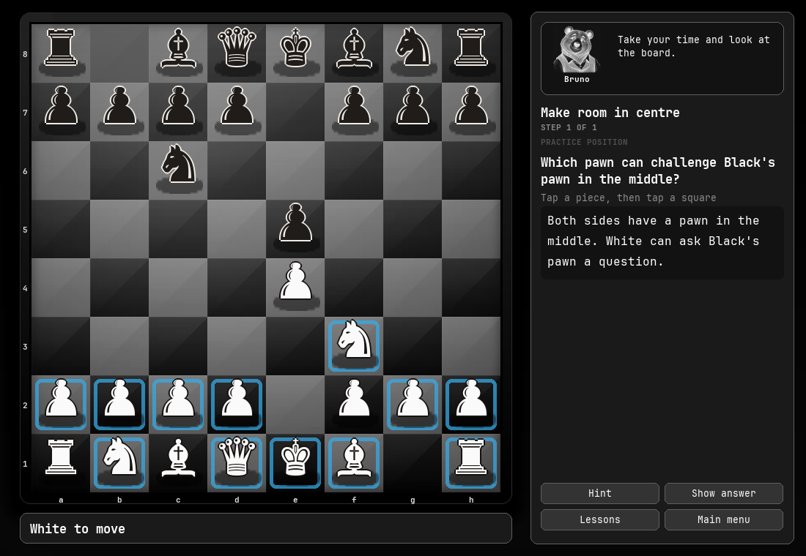

# uroschess

[](https://github.com/urosdrnovsek/uroschess/actions/workflows/ci.yml)
[](LICENSE)

Uroschess is a small desktop chess app. Play against the computer or another
person at the same computer, and use short lessons to practise making a plan.
The lessons may be useful for children who already know how the pieces move,
what check and checkmate mean. They cover ideas such as developing
pieces, looking after the king, coordinating an attack, and simple endgames.

| Play | Learn |
| --- | --- |
|  |  |

## Run

On Linux with Python 3.8 or newer:

```bash
./run.sh
```

The script creates a virtual environment and installs `pygame` if needed. You
can also install the package with `pipx`:

```bash
pipx install git+https://github.com/urosdrnovsek/uroschess
uroschess
```

`pygame` is the only runtime dependency. The app works offline. It uses your
Omarchy colours when available and otherwise uses a built-in dark theme.

## What is in the app

- **Play:** choose White or Black against the computer, play locally with a
  friend, or let the computer play both sides. The difficulty setting changes
  how long the computer thinks.
- **Learn:** try short move exercises about openings, tactics, and endgames.
  Each question has a hint and an answer you can reveal. You can retry and
  return later; progress is saved on this computer.
- **Watch games:** step through recorded moves and brief notes. The historical
  scores are shown without player identities; the lesson practice positions
  are separate from those scores.

Bruno the Bear and Olive the Owl are fictional coaches with original chess
tips. Their portraits and advice were created for Uroschess.

| Main menu | Opening lessons |
| --- | --- |
|  |  |

In a lesson, read the question beside or below the board and make a move.
**Hint** gives a clue; **Show answer** reveals a move. After a move, the panel
shows feedback and a clear next step. The lesson buttons also let you return
to the lesson list or main menu. On a small window, the board and lesson panel
stack vertically.

## Controls

- Move by clicking or dragging pieces. Arrow keys and Enter or Space also work
  for selecting squares.
- **F** flips the board. **Esc** goes back. **M** returns to the main menu from
  a lesson.
- **Tab** moves keyboard focus between visible buttons; **Enter** activates one.
- In a replay, use the on-screen controls or Left and Right to step through
  moves. Space starts or pauses autoplay.
- In a game, **R** starts over and **U** takes back a move. **S** saves a PGN;
  **L** loads `game.pgn` from the working directory.

The window is resizable. **Appearance** offers board styles, piece colours,
text sizes, and a sound switch. Settings and lesson progress are kept locally.

## Development

```bash
pytest
python -m scripts.validate_content
python -m scripts.smoke
python -m scripts.update_readme_screenshots
```

The [content format](docs/CONTENT_FORMAT.md) describes the bundled lessons.
The [learner review guide](docs/LEARNER_REVIEW.md) lists questions to try with
children before expanding the lessons.

MIT licensed; see [LICENSE](LICENSE).
