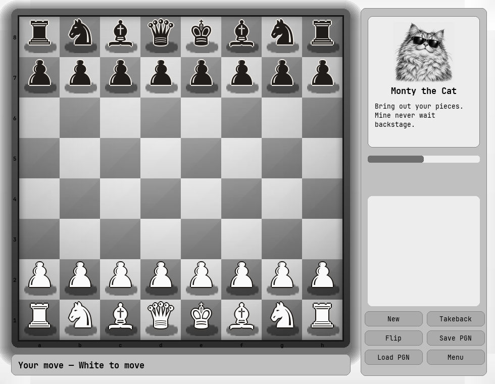
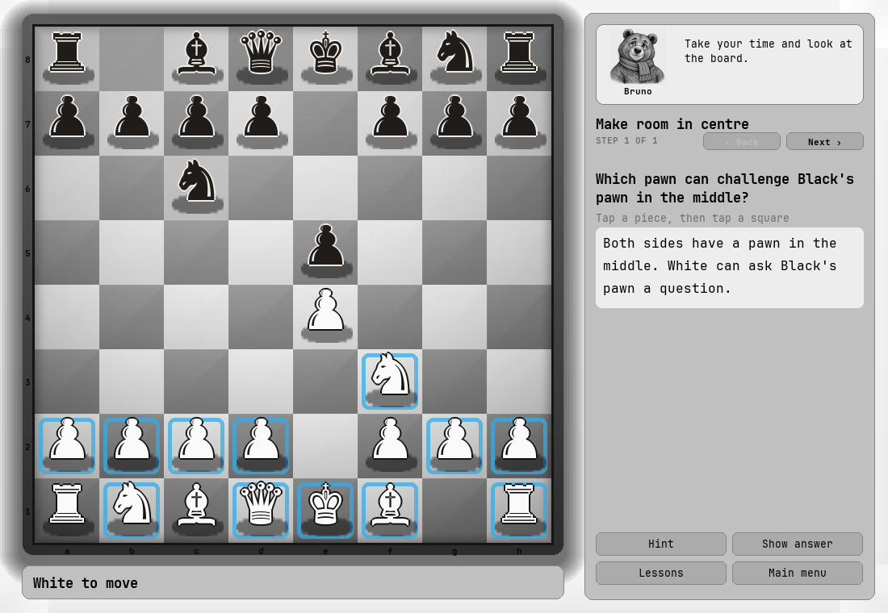
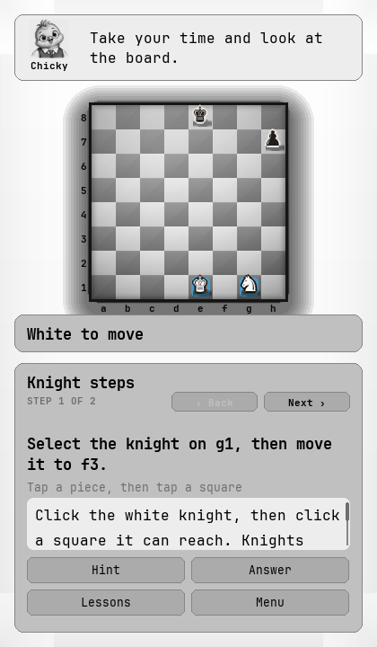
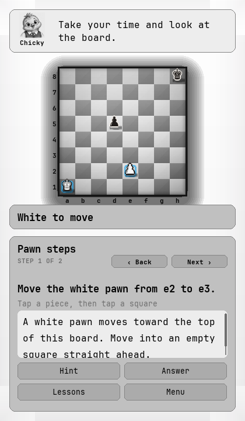
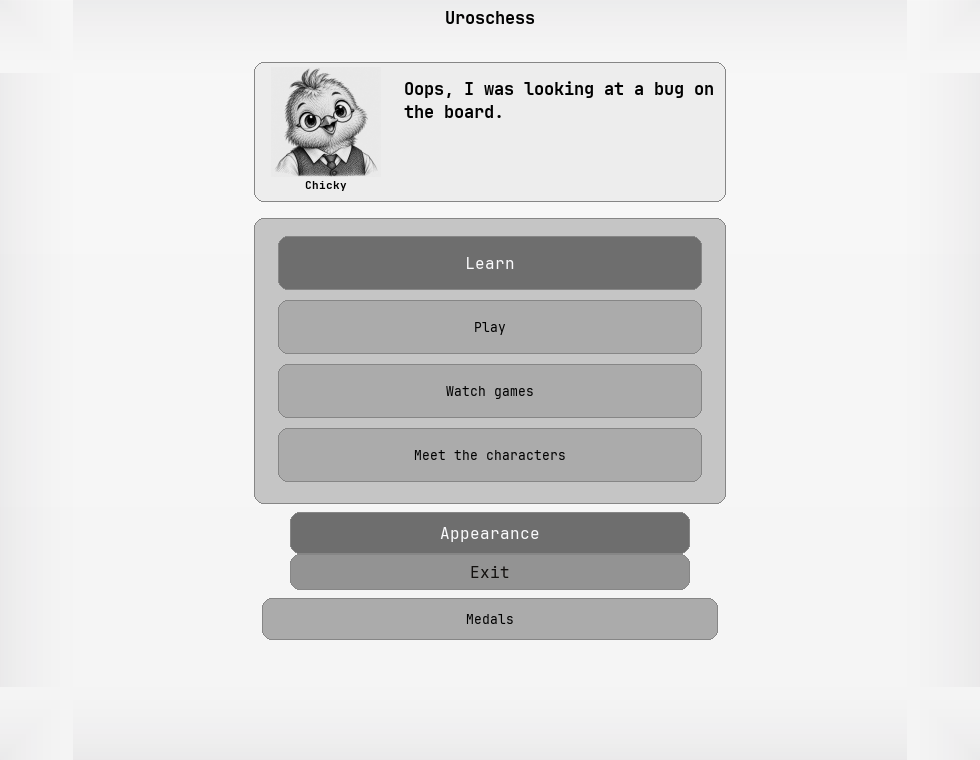
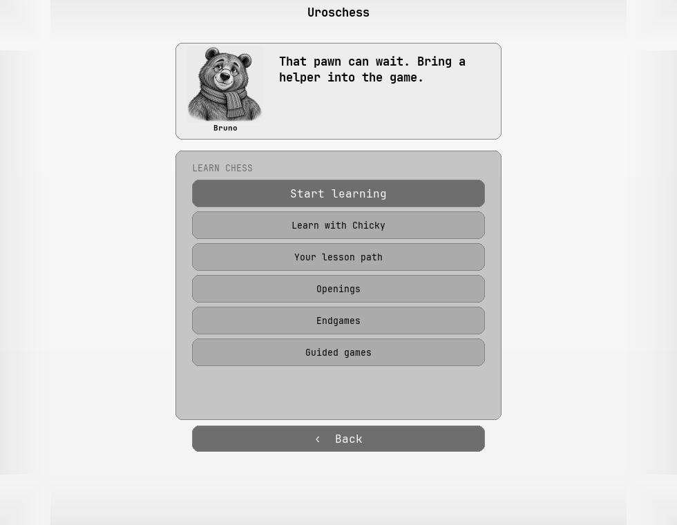
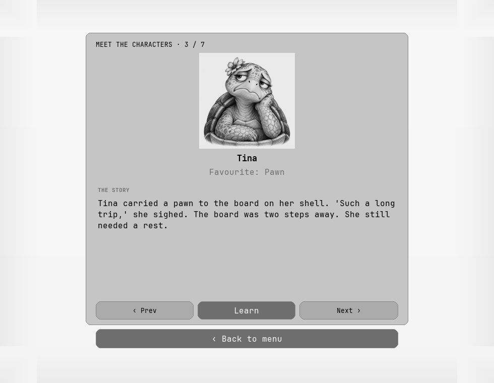
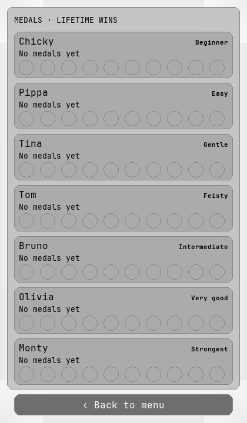

# uroschess

[](https://github.com/urosdrnovsek/uroschess/actions/workflows/ci.yml)
[](LICENSE)

Uroschess is a small desktop chess app. Play against the computer or another
person at the same computer, and use short lessons to practise making a plan.
Chicky's beginner course introduces piece moves, simple captures, king safety,
and checkmate. Pippa's first course practises useful developing moves, and
Tina's first course shows how a pawn becomes a queen, how a king can support
one, and why stalemate is a draw. Tom's first opening course practises spotting
an attack on a pawn and choosing a sound reply. Bruno's planning lesson
improves a quiet bishop and puts a rook on an open file. Olivia's first puzzle
uses a knight fork to win a queen. The strategy lessons
may be useful for children
who already know how the pieces move and what check and
checkmate mean. They cover ideas such as developing pieces, looking after the
king, coordinating an attack, and simple endgames.

| Play | Learn |
| --- | --- |
|  |  |

## Run

On Linux with Python 3.9 or newer:

```bash
./run.sh
```

The script creates a virtual environment and installs `pygame` if needed. You
can also install the package with `pipx`:

```bash
pipx install git+https://github.com/urosdrnovsek/uroschess
uroschess
```

`pygame` is the only runtime dependency. The app works offline. It uses your
Omarchy colours when available and otherwise uses a built-in dark theme.

## What is in the app

- **Play:** choose White or Black against the computer, play locally with a
  friend, or let the computer play both sides. The difficulty setting changes
  how long the computer thinks. **Character Challenge** is a separate offline
  journey through Chicky, Pippa, Tina, Tom, Bruno, Olivia, and Monty. Beat each
  character with White and then Black to unlock the next; fourteen wins earn
  the Uroschess Master title. An unfinished match can be resumed later. If its
  saved history cannot be verified, Character Challenge explains the problem
  and offers Retry, Export, and Archive and start again. The Play menu keeps a
  Saved match archive so diagnostic copies can be exported later. Exports are
  written beside the local progress database; the recovery screen shows the
  filename and folder. Every verified checkmate win also earns a character
  medal, including rematches. **Medals** on the main menu opens all seven
  characters' collections on one page. Each win fills one portrait circle;
  the tenth replaces that character's row with a larger gold circle. The
  collection also shows lifetime counts. The result screen
  distinguishes a new colour badge from a previously earned one. The Master
  celebration is dismissed explicitly and its title remains earned.
- **Learn:** choose one of seven character guides. Each portrait explains what
  that character teaches and opens their courses and practice lessons. Chicky's
  seven beginner lessons start with piece moves; Pippa and Tom teach openings,
  Tina teaches endgames, Bruno teaches plans, and Olivia teaches tactics.
  Monty's analysis of a recorded tournament game unlocks after one verified
  Character Challenge win against him with either colour. This is separate
  from the Master title, which still needs both colours.
  Each question has a hint and an answer you can reveal. You can retry and
  return later; progress is saved on this computer.
- **Watch games:** step through recorded moves and brief notes. The historical
  scores are shown without player identities; the lesson practice positions
  are separate from those scores.

Bruno the Bear and Olivia the Owl are fictional coaches with original chess
tips. Their portraits and advice were created for Uroschess.
Monty's commentary is also original; his favourite historical game is the
[1889 Amsterdam tournament score](https://en.wikipedia.org/wiki/Lasker_versus_Bauer,_Amsterdam,_1889),
shown without player identities in the app.

Choose **Meet the characters** on the main menu to browse all seven animals,
read their short stories, and see their favourite chess pieces. Click the
larger portrait on the main menu, or press **N**, to see another character's
quote.





| Main menu | Choose a guide |
| --- | --- |
|  |  |





In a lesson, read the question beside or below the board and make a move.
**Hint** gives a clue; **Show answer** reveals a move. After a move, the panel
shows feedback and a clear next step. The back and next arrows beside the step
label move between that character's lessons; the lesson buttons also let you
return to the lesson list or main menu. On a small window, the board and lesson
panel stack vertically.

## Controls

- Move by clicking or dragging pieces. Arrow keys and Enter or Space also work
  for selecting squares.
- **F** flips the board. **Esc** goes back. **M** returns to the main menu from
  a lesson.
- **Tab** moves keyboard focus between visible buttons; **Enter** activates one.
- In a replay, use the on-screen controls or Left and Right to step through
  moves. Space starts or pauses autoplay.
- In an ordinary game, **R** starts over and **U** takes back a move. **S** saves
  a PGN; **L** loads `game.pgn` from the working directory. Challenge matches
  have fixed opponents and no takeback or PGN import. **Save & return** keeps
  the current match; **Resign** asks for a second click before ending it.

The window is resizable. **Appearance** offers board styles, piece colours,
text sizes, and a sound switch. Settings, lesson progress, and challenge badges
are kept locally.

## Development

```bash
pytest
python -m scripts.validate_content
python -m scripts.smoke
python -m scripts.update_readme_screenshots
```

The [content format](docs/CONTENT_FORMAT.md) describes the bundled lessons.
The [learner review guide](docs/LEARNER_REVIEW.md) lists questions to try with
children before expanding the lessons.

MIT licensed; see [LICENSE](LICENSE).
